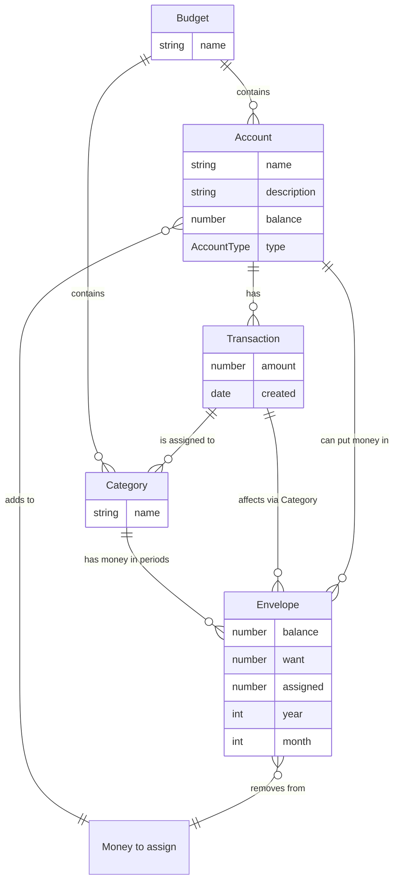

# cat_budget

A new Flutter project.

## Run Widgetbook

```bash
flutter run -t /widgetbook/main.widgetbook.dart
```

## Run build files

```bash	
flutter pub run build_runner build
```

## Getting Started

This project is a starting point for a Flutter application.

A few resources to get you started if this is your first Flutter project:

- [Lab: Write your first Flutter app](https://docs.flutter.dev/get-started/codelab)
- [Cookbook: Useful Flutter samples](https://docs.flutter.dev/cookbook)

For help getting started with Flutter development, view the
[online documentation](https://docs.flutter.dev/), which offers tutorials,
samples, guidance on mobile development, and a full API reference.

## Sums
- `Total balance = <Sum of all account balances>`
- `Account balance = <Initial balance> + <Total inflow> - <Total outflow>`
- `Money to assign balance = <Income> - <Sum of all money manually assigned to envelopes>`
- `Income = <Sum of all transactions with category "Income">`
- `Envelope balance = <Balance of envelope in previous period> + <Money manually assigned to envelope> + <Total inflow> - <Total outflow>`

## Flow: Adding a transaction

1. Transaction is added.
2. Account balance is updated
3. Money to assign balance is updated (if transaction is income)
4. Envelope balance is updated (if transaction is not income)

## Flow: Assigning money to envelope

1. Money is assigned to envelope 
2. Money to assign balance is updated 
3. Envelope balance is updated

## Flow: Calculating balances for period

1. Period is opened (month)
2. Envelope balance is calculated for each envelope in period
3. Latest account balance is calculated for each account
4. Money to assign balance is calculated


In the future, we could add some checkpoints.

